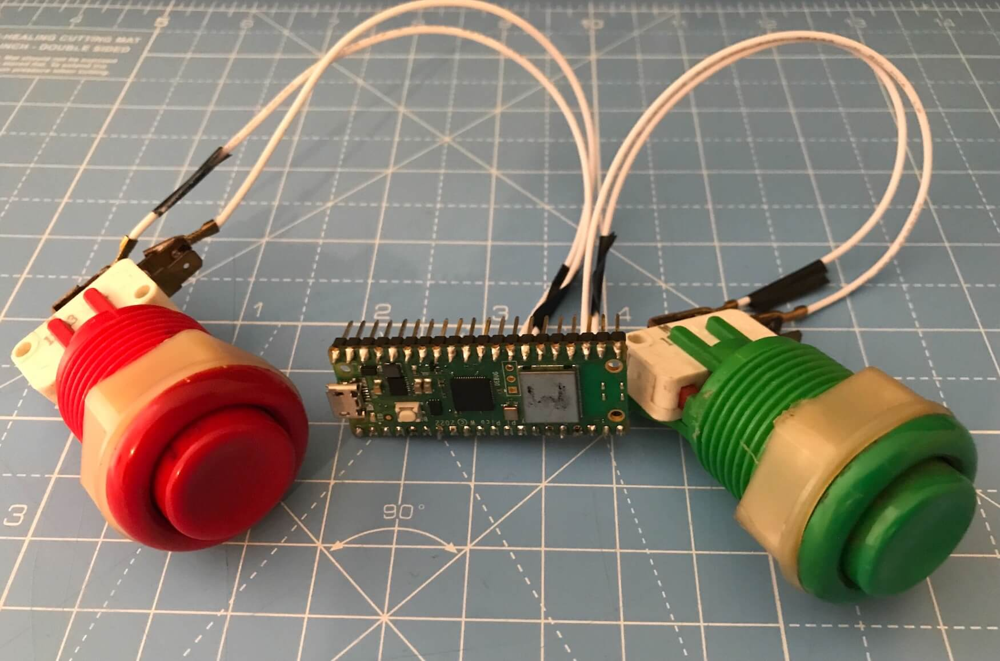

# Button Counter Example




This is an example MicroPython script that uses a Raspberry Pi Pico W and two arcade or similar style buttons to send counter metrics to a Prometheus remote write endpoint, such as the one provided with Grafana Cloud.

## Hardware

To try this out you'll need the following hardware:

* 1 Raspberry Pi [Pico W](https://thepihut.com/products/raspberry-pi-pico-w?variant=41952994787523) or [Pico 2 W](https://thepihut.com/products/raspberry-pi-pico-2-w?variant=54063378760065) - get one with headers already attached, so that you don't have to buy these separately and solder them on yourself. These are also known as the "WH" versions.
* 1 [USB to Micro USB data cable](https://thepihut.com/products/usb-to-micro-usb-cable-0-5m?variant=37979679293635), used to power the Pico W and install software on it.
* 2 [arcade buttons](https://thepihut.com/products/arcade-button-30mm-translucent-red) (I'm using a red and a green one but you can use any!).  
* 1 pack of [spade connector to female jumper wires](https://thepihut.com/products/4-8mm-spade-to-female-jumper-wires-10-pack). These are used to connect the buttons to the GPIO pins on the Pico W. You'll need 4 wires, they come in packs of 10.

## Assembling the Hardware

TODO

## MicroPython Version

You'll need to install a MicroPython runtime on the Pico W.  Get the latest `.uf2` image and follow the installation instructions:

* [Image for Raspberry Pi Pico W](https://micropython.org/download/RPI_PICO_W/)
* [Image for Raspberry Pi Pico 2 W](https://micropython.org/download/RPI_PICO2_W/)

We've tested the code using MicroPython 1.25.

## Configure and Install the Code

Now its time to copy the source code to your Pico W and configure the WiFi network and Prometheus remote write endpoint credentials.

At your terminal, first change to the correct directory:

```bash
cd button-counter
```

### Configuring Secrets

Next, create a `secrets.py` file by copying the example provided:

```bash
cp secrets_example.py secrets.py
```

Using a text editor, edit `secrets.py`, replacing the values of the following parameters with yours:

* `WIFI_SSID` - the SSID (network name) for your wireless network.
* `WIFI_PASSWORD` - the password / passphrases for your wireless network.
* `PROMETHEUS_ENDPOINT` - the URL for your Prometheus remote write endpoint on Grafana Cloud. It will look something like `https://prometheus-<HOST>.grafana.net/api/prom/push`
* `PROMETHEUS_USER` - Your Prometheus remote write user name or instance ID for Grafana Cloud. It will be a series of digits.
* `PROMETHEUS_PASSWORD` - Your Grafana Cloud API token.

Save your changes.

### Install Third Party Dependencies

This example uses a small library that provides helper functions to create the protocol buffer payloads that Prometheus uses for remote write. With your Pico W connected to your machine via the USB to Micro USB cable, install the library with this command:

```bash
mpremote mip install github:ttk1/prometheus_remote_write_payload
```

### Copying Code to the Pico W

We'll copy the source code to the Pico W using the `mpremote` command.  Connect your Pico W to your machine using the USB to Micro USB cable, then enter the following commands:

```bash
mpremote fs cp main.py :main.py
mpremote fs cp secrets.py :secrets.py
```

Verify that the code was copied correctly:

```bash
mpremote fs ls
```

then 

```bash
mpremote fs ls lib/
```

You should see output similar to this (your file sizes may vary from those shown):

```
ls :
           0 lib/
        2451 main.py
         362 secrets.py
```

```
ls :lib/
           0 prometheus_remote_write_payload/
```

## Run the Code

With your Pico W connected to your machine by the USB to MicroUSB cable, run the code like so:

```bash
mpremote run main.py
```

You should see output similar to the following on the MicroPython console as the code starts up and connects to the network:

```
Connecting to wifi...
Connecting to wifi...
Connecting to wifi...
Connecting to wifi...
Connected, IP address: 192.168.4.45, time: 1748349089
```

## Mash those Buttons!

Now for the fun part!  Press the button that adds one to the counter metric (on my setup this is the green button).  Do this several times over a period of time.  You'll see the button presses being captured and data sent to the Prometheus remote write endpoint at the MicroPython console:

```
Connected, IP address: 192.168.4.45, time: 1748349869
Pressed!
Sending data...
Data sent: num_presses 1.
Pressed!
Sending data...
Data sent: num_presses 2.
Pressed!
Sending data...
Data sent: num_presses 3.
Pressed!
Sending data...
Data sent: num_presses 4.
Pressed!
Sending data...
Data sent: num_presses 5.
Pressed!
Sending data...
Data sent: num_presses 6.
```

If at any point you want to reset the counter, press the reset button (on my setup this is the red button):

```
Count reset to 0.
```

This resets the count to 0 locally, so the next button press on the count (green) button will send a new count of 1.

## Visualizing the Metrics with Grafana Cloud

TODO