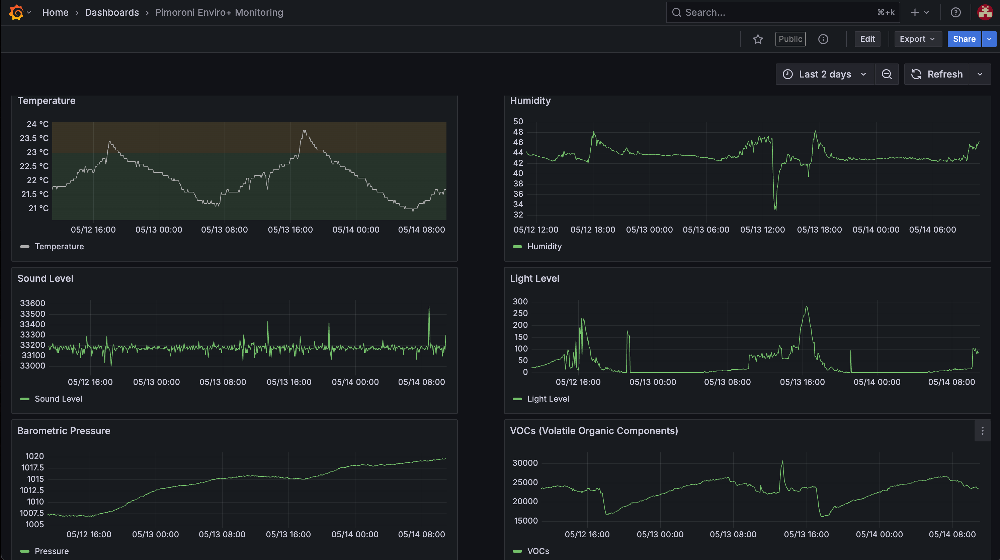
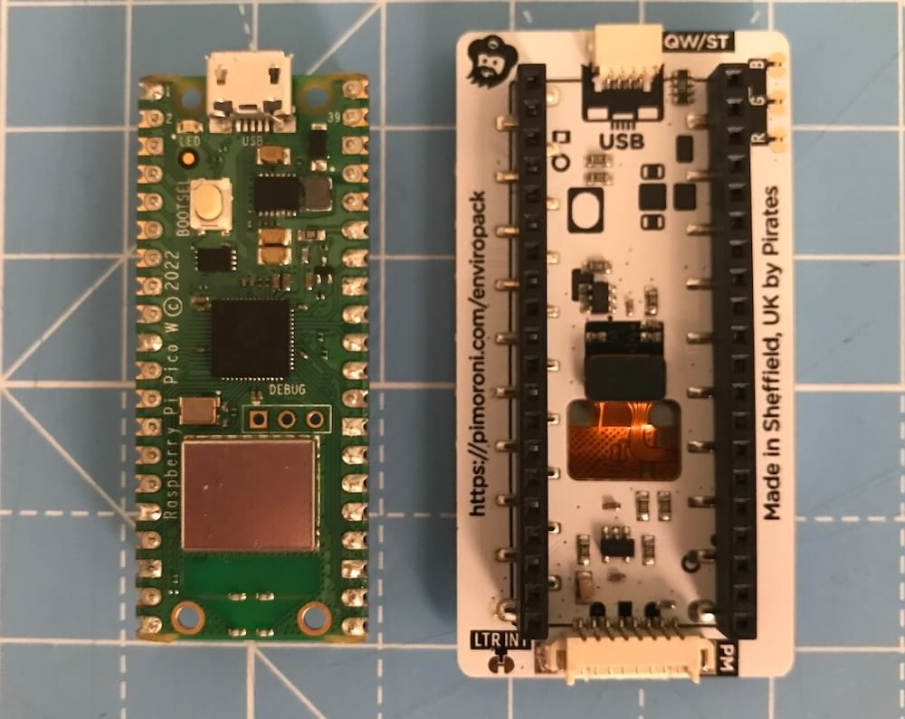

# Environment Monitoring with the Pimoroni Enviro+ and Grafana Cloud



[Check out the live dashboard here](https://simonprickett.grafana.net/public-dashboards/de7fbc0983314bf88143e4d748d1d359)!

This is a basic demonstration MicroPython script that gathers data from the different types of sensor built into the Pimoroni Enviro+ Pack and sends it to a Prometheus remote write endpoint. We're using Grafana Cloud for data storage and visualization but other solutions should work too.

## Grafana Cloud Setup

TODO - consider moving this to the main README as a common pre-requisite.

## Hardware

This demo requires some specific hardware items to run on. These are:

* 1 Raspberry Pi [Pico W](https://shop.pimoroni.com/products/raspberry-pi-pico-w?variant=40059369652307) - get one with headers already attached, so that you don't have to buy these separately and solder them on yourself. These are also known as the "WH" versions.  At the time of writing, the required MicroPython build for this project wasn't readily available for the Pico 2 W so avoid those and stick with the original model.
* Alternatively, you can use a [Raspberry Pi Pico 2W](https://shop.pimoroni.com/products/raspberry-pi-pico-2-w?variant=54852253024635) - again, get one with the headers already attached.  These cost a little more, and are a little more capable (faster, more RAM) but this project will work fine with the original Pico W if you are budget aware.
* 1 Pimoroni [Pico Enviro+ Pack](https://shop.pimoroni.com/products/pico-enviro-pack?variant=40045073662035) (just get the pack, you don't need any of the extra accessories such as the external particulate sensor).
* 1 [USB to Micro USB data cable](https://shop.pimoroni.com/products/usb-a-to-microb-cable-black?variant=31241639562). This is for powering the device and installing software on it.

## Assembling the Hardware

Align the Pico W's header pins with the female headers on the back of the Pico Enviro+ Pack. Ensure that the micro USB port on the Pico W is at the right end of the Pico Enviro+ Pack - you'll find an outline of a micro USB port and a "USB" label printed there. Once you have the two components aligned, apply a firm but even pressure to press the Pico W's headers fully into the Pico Enviro+ Pack. That's all there is to it, you're ready to go!



## MicroPython Version

You'll need to install a MicroPython runtime on the Pico W. The Enviro+ Pack uses a specific build of Pimoroni MicroPython which has all of the sensor drivers you need built in.  

* If you have a Pico W, download the latest from Pimoroni's GitHub [here](https://github.com/pimoroni/pimoroni-pico/releases). Be sure to get the file named `enviro-<version>-pimoroni-micropython.uf2`.
* If you are using s Pico 2W, download [this version](https://github.com/pimoroni/pimoroni-pico-rp2350/releases), also from Pimoroni's GitHib.

TODO how to install that.

## Install Dependencies

TODO

```bash
mpremote mip install github:ttk1/prometheus_remote_write_payload
```

Verify that the code was installed by runnning this command:

```bash
mpremote fs ls lib
```

You should see output similar to the following:

```
ls :lib
           0 prometheus_remote_write_payload/
```

## Configure and Install the Code

Now its time to copy the source code to your Pico W and configure the WiFi network and Prometheus remote write endpoint credentials.

At your terminal, first change to the correct directory:

```bash
cd pimoroni-enviro-plus
```

### Configuring Secrets

Next, create a `secrets.py` file by copying the example provided:

```bash
cp secrets_example.py secrets.py
```

Using a text editor, edit `secrets.py`, replacing the values of the following parameters with yours:

* `WIFI_SSID` - the SSID (network name) for your wireless network.
* `WIFI_PASSWORD` - the password / passphrases for your wireless network.
* `PROMETHEUS_ENDPOINT` - the URL for your Prometheus remote write endpoint on Grafana Cloud. It will look something like `https://prometheus-<HOST>.grafana.net/api/prom/push`
* `PROMETHEUS_USER` - Your Prometheus remote write user name or instance ID for Grafana Cloud. It will be a series of digits.
* `PROMETHEUS_PASSWORD` - Your Grafana Cloud API token.

Save your changes.

### Copying Code to the Pico W

TODO further instructions...

```bash
mpremote fs cp main.py :main.py
mpremote fs cp secrets.py :secrets.py
```

## Run the Code

TODO
